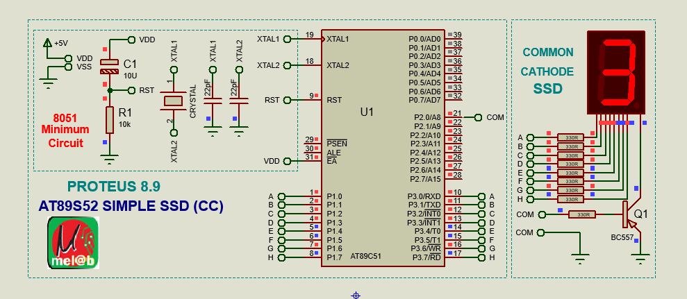

# Interfacing a Seven Segment Display with the 8051 Microcontroller  
### A Step-by-Step Technical Guide (Assembly + Proteus Simulation + Hardware Test)


---

<p align="center">
	<br><br>
  
  <br>
  <span style="color:blue;"><b>Figure 1: Seven Segment Display with 8051 Microcontroller</b></span>
	<br><br><br>
</p>


---

## Introduction


Seven-segment displays are widely used to show decimal numbers in embedded systems.
This article is about how to interface a seven segment LED display to any mi-crocontroller.
Funny thing is that if you want to control a single digit 7 segmentdisplay, then it is
nothing but controlling 7 LED’s as we learnt from the previous experiment. For multiple 
segments, there are simple studies for hardware and soft-ware as well.

However a good Knowledge about how to interface a seven segmentdisplay to a microcontroller
is very essential in designing embedded systems.

In this tutorial, you will learn:

- How a seven-segment display works  
- How to interface it with the **8051 microcontroller**  
- How to write **Assembly code** to display digits  
- How to simulate the circuit in **Proteus**  
- Tested output photos & video demonstration  
- Reference links for further learning  

This guide is suitable for **beginners**, **students**, and **hobbyists**.

---

## 🧰 Requirements

### 🔹 Hardware  
- AT89C51 / AT89S51 Microcontroller  
- Common Cathode Seven-Segment Display  
- 10kΩ Resistor Pack (optional)  
- 330Ω Current-limiting resistors  
- Breadboard / PCB  
- +5V Power Supply  

### 🔹 Software  
- **Keil uVision** (for Assembly programming)  
- **Proteus 8 Professional** (for simulation)  

---

## Seven-Segment Display Characteristics

Seven-segment displays are available as:  
- **Common Cathode (CC)**  
- **Common Anode (CA)**  

Common features include:
- Sizes: 9.14 mm, 14.20 mm, 20.40 mm, 38.10 mm, 57 mm, 100 mm  
- Available in single and multi-digit packages  
- Colors: Red, Yellow, Green, Blue, White  
- Typical current consumption: **30 mA / segment**  
- Peak current: **70 mA / segment**  
- Good visibility over distance  

In this project, a **single-digit Common Cathode SSD** is used.

---


## 🔤 Seven Segment Display Pin Mapping

| Segment | Pin | Description |
|--------|-----|-------------|
| a | 10 | Top segment |
| b | 9 | Upper right |
| c | 8 | Lower right |
| d | 7 | Bottom |
| e | 6 | Lower left |
| f | 5 | Upper left |
| g | 4 | Middle |
| dp | 3 | Decimal point |

💡 **We will use Port-1 of 8051** to drive segments:  
`P1.0 → a`, `P1.1 → b`, … `P1.6 → g`

---

## 🧮 Seven Segment HEX Codes (Common Cathode)

| Number | Segments ON | HEX Code |
|--------|-------------|----------|
| 0 | a b c d e f | `0x3F` |
| 1 | b c | `0x06` |
| 2 | a b d e g | `0x5B` |
| 3 | a b c d g | `0x4F` |
| 4 | f g b c | `0x66` |
| 5 | a f g c d | `0x6D` |
| 6 | a f e d c g | `0x7D` |
| 7 | a b c | `0x07` |
| 8 | All | `0x7F` |
| 9 | a b c d f g | `0x6F` |

````

````

---


## 💻 Assembly Code for Displaying 0–9 Continuously


```asm
;====================================================================
; 8051 MCU INTYERFACING WITH 7 SEGMENT LED DISPLAY
; 
; Created     : Sun, Oct 30 2022
; Processor   : AT89S52 (wITH 11.0592 Crystal Oscillator)
; Compiler    : MIDE-51 (WINASM)
; Simulator   : PROTEUS 8.9
; Hardware    : avrPRO (Ver.22.0) Development Board and  Tested OK
; Single Digit Common Cathode 7 Segment Display used (As IN Hardware)
;====================================================================

;====================================================================
; DEFINITIONS
;====================================================================
	PORT	EQU	P1

;====================================================================
; VARIABLES
;====================================================================

;====================================================================
; RESET and INTERRUPT VECTORS
;====================================================================
      ORG	00H		; Reset Vector Address
      AJMP	START		; Jump TO Main Program
;====================================================================
; CODE SEGMENT
;====================================================================
	ORG	030H
START:
	MOV	PORT,#00H	; CLEARING 7 SEG DATA PORT
LOOP1:
	MOV 	PORT,#00111111B	; Data Pattern for No. "0"
	LCALL	ONE_SEC		; One Second Delay
	MOV 	PORT,#00000110B	; Data Pattern for No. "1"
	LCALL	ONE_SEC		; One Second Delay
	MOV 	PORT,#01011011B	; Data Pattern for No. "2"
	LCALL	ONE_SEC		; One Second Delay
	MOV 	PORT,#01001111B	; Data Pattern for No. "3"
	LCALL	ONE_SEC		; One Second Delay
	MOV 	PORT,#01100110B	; Data Pattern for No. "4"
	LCALL	ONE_SEC		; One Second Delay
	MOV 	PORT,#01101101B	; Data Pattern for No. "5"
	LCALL	ONE_SEC		; One Second Delay
	MOV 	PORT,#01111101B	; Data Pattern for No. "6"
	LCALL	ONE_SEC		; One Second Delay
	MOV 	PORT,#00000111B	; Data Pattern for No. "7"
	LCALL	ONE_SEC		; One Second Delay
	MOV 	PORT,#01111111B	; Data Pattern for No. "8"
	LCALL	ONE_SEC		; One Second Delay
	MOV 	PORT,#01101111B	; Data Pattern for No. "9"
	LCALL	ONE_SEC		; One Second Delay

	LJMP	LOOP1

;====================================================================
; ONE_SEC: (Subroutine to Delay ONE Second)
; Uses Register R7 but Preserves this Register 
;====================================================================
ONE_SEC: 
 	PUSH	07H		; Save R7 to Stack 
 	MOV	R7, #250D	; LOAD R7 to Count 250 Loops
LOOP_SEC:	; Calls 4 One Millisec. Delays, 250 times 
 	LCALL	ONE_MILL_SEC	; Call 1 MilliSecond Delay
 	LCALL	ONE_MILL_SEC	; Call 1 MilliSecond Delay
 	LCALL	ONE_MILL_SEC	; Call 1 MilliSecond Delay
 	LCALL	ONE_MILL_SEC	; Call 1 MilliSecond Delay
 	DJNZ 	R7, LOOP_SEC 	; Decrement R7, if not Zero loop back 
 	POP 	07H		; Restore R7 to Original value 
	RET
;====================================================================
; ONE_MILL_SEC: (Subroutine to Delay ONE Milli Second)
; Uses Register R7 but Preserves this Register 
;====================================================================
ONE_MILL_SEC: 
	PUSH	07H		; Save R7 to Stack   
	MOV 	R7, #250D	; LOAD R7 to Count 250 Loops
LOOP_1_MS:			; Loops 250 times 
	NOP			; Inserted NOPs to cause Delay 
 	NOP			; 
 	DJNZ 	R7, LOOP_1_MS	; Decrement R7, if not Zero loop back 
	POP	07H		; Restore R7 to Sriginal value 
	RET			; Return from Subroutine
;====================================================================

      END			; end of program
;====================================================================
; END of the Assembly Program
;====================================================================

````

---


## 💻 Assembly Code for Displaying 0–9 Continuously (using Lookup Table)

```asm
;====================================================================
; 8051 MCU INTYERFACING WITH 7 SEGMENT LED DISPLAY
; 
; CREATED     : SUN, OCT 30 2022
; PROCESSOR   : AT89S52 (WITH 11.0592 CRYSTAL OSCILLATOR)
; COMPILER    : MIDE-51 (WINASM)
; SIMULATOR   : PROTEUS 8.9
; HARDWARE    : AVRPRO (VER.22.0) DEVELOPMENT BOARD AND  TESTED OK
; SINGLE DIGIT COMMON CATHODE 7 SEGMENT DISPLAY USED (AS IN HARDWARE)
; LOOK UP TABLE USED.
;====================================================================

;====================================================================
;====================================================================
      	ORG   0000H		; RESET VECTOR ADDRESS

	MOV	P2,#11111110B	; 

MAIN_LOOP:
	MOV	R5,#0D
	MOV	R6,#09D

REPEAT:
	MOV	A,R5
	MOV 	DPTR,#SSD_CC
	MOVC 	A,@A+DPTR
	MOV 	P3,A
	LCALL	ONE_SEC
	INC	R5
	MOV	A,R5
	SUBB	A,R6
	JZ	MAIN_LOOP
	LJMP	REPEAT
;====================================================================
;====================================================================

;====================================================================
; ONE_SEC: (Subroutine to Delay ONE Second)
; Uses Register R7 but Preserves this Register 
;====================================================================
ONE_SEC: 
 	PUSH	07H		; Save R7 to Stack 
 	MOV	R7, #250D	; LOAD R7 to Count 250 Loops
LOOP_SEC:	; Calls 4 One Millisec. Delays, 250 times 
 	LCALL	ONE_MILL_SEC	; Call 1 MilliSecond Delay
 	LCALL	ONE_MILL_SEC	; Call 1 MilliSecond Delay
 	LCALL	ONE_MILL_SEC	; Call 1 MilliSecond Delay
 	LCALL	ONE_MILL_SEC	; Call 1 MilliSecond Delay
 	DJNZ 	R7, LOOP_SEC 	; Decrement R7, if not Zero loop back 
 	POP 	07H		; Restore R7 to Original value 
	RET
;====================================================================
; ONE_MILL_SEC: (Subroutine to Delay ONE Milli Second)
; Uses Register R7 but Preserves this Register 
;====================================================================
ONE_MILL_SEC: 
	PUSH	07H		; Save R7 to Stack   
	MOV 	R7, #250D	; LOAD R7 to Count 250 Loops
LOOP_1_MS:			; Loops 250 times 
	NOP			; Inserted NOPs to cause Delay 
 	NOP			; 
 	DJNZ 	R7, LOOP_1_MS	; Decrement R7, if not Zero loop back 
	POP	07H		; Restore R7 to Sriginal value 
	RET			; Return from Subroutine
;====================================================================

;====================================================================
ORG  300H
SSD_CC:	DB 3FH,06H,05BH,04FH,066H,06DH, 07DH,07H,07FH,06FH
;====================================================================
      END
;====================================================================
; END of the Assembly Program
;====================================================================

````

## 🧪 Proteus Simulation

### 🔧 Steps to Create Simulation

1. Open **Proteus 8 Professional**
2. Create a new project
3. Add components:

   * AT89C51
   * Seven Segment Display (Common Cathode)
   * Resistors
4. Connect **P1.0 – P1.6** to segments:

   * P1.0 → a
   * P1.1 → b
   * ...
   * P1.6 → g
5. Load the generated `.hex` file
6. Click **Run Simulation**

---

## Hardware Implementation (Optional)
---
If you are testing on a real development board:

Ensure segment current never exceeds 30 mA

Use appropriate resistor values

Verify common pins are connected to GND (Common Cathode)

Check correct orientation of the SSD

Photos (Placeholders)
images/hardware_front_view.jpg  
images/hardware_output.jpg  

---

## Video Demonstration (Placeholder)

Upload your test video and link it here:

[Watch the Demonstration](https://your-video-link.com)

---

## Troubleshooting Guide
---
Problem	Possible Cause	Solution
All segments off	Wrong common pin connection	Ensure SSD is Common Cathode and tied to GND
Incorrect digit shown	Wrong bit pattern	Verify HEX codes
Display too dim	High-value resistors	Reduce resistor value to 220–330Ω
No response	Incorrect HEX file loaded	Regenerate and reload HEX.

---

## Advanced Extensions

You may extend this project to:

Four-digit multiplexed seven-segment display

Stopwatch or digital clock

Frequency counter

Sensor value display via ADC

Up/Down counter with push buttons
---


## Circuit Discussion :

The circuit diagram shown above is of an AT89S51 microcontroller based 0 to 9 counter which has a 7 segment 
LED display interfaced to it in order to display the count. This simple circuit illustrates two things. 
How to setup simple 0 to 9 up counter using 8051 and more importantly how to interface a seven segment 
LED display to 8051 in order to display a particular result. The common cathode seven segment display D1 
is connected to the Port 1 of the microcontroller (AT89S51) as shown in the circuit diagram. R3 to R10 
are current limiting resistors. S3 is the reset switch and R2,C3 forms a debouncing circuitry. C1, C2 and 
X1 are related to the clock circuit. The software part of the project has to do the following tasks.

## 🎥 Video Demonstration

> *(Insert demo video link after upload)*

```md
[▶ Watch the Demo Video](https://your-video-link.com)
```

---

## 🔗 Similar Reference Links

* [https://exploreembedded.com/wiki/Seven_segment_with_8051](https://exploreembedded.com/wiki/Seven_segment_with_8051)
* [https://www.electronicsforu.com](https://www.electronicsforu.com)
* [https://microcontrollerslab.com](https://microcontrollerslab.com)
* [https://embeddedlab.com](https://embeddedlab.com)

---

## 📝 Conclusion

In this tutorial, you learned:

* Seven segment working
* Pin configuration
* Generating correct HEX codes
* Assembly program to display 0–9
* Proteus simulation setup

This is one of the most fundamental 8051 interfacing experiments.
You can now extend this to:

✔ Multiplexed 4-digit display
✔ Stopwatch
✔ Digital counter
✔ Sensor value display

---
