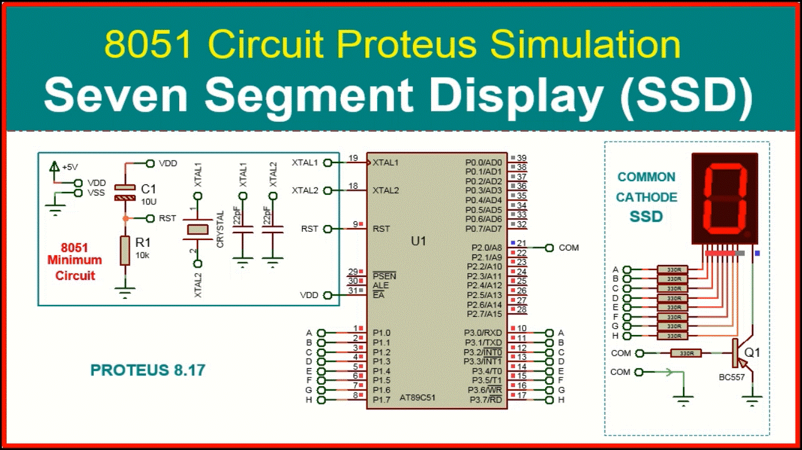

# ⭐ Interfacing a Seven Segment Display with the 8051 Microcontroller

### A Step-by-Step Technical Guide (Assembly + Proteus Simulation + Hardware Test)

---

<p align="center">
  
  <br>
  <span style="color:#0077ff;"><b>Figure 1: Seven Segment Display connected to the AT89C51 Microcontroller</b></span>
</p>

---

## 📘 Introduction

<p align="justify">
	Seven-segment displays are widely used to show decimal numbers in embedded systems.
This article is about how to interface a seven segment LED display to any mi-crocontroller.
Funny thing is that if you want to control a single digit 7 segmentdisplay, then it is 
nothing but controlling 7 LED’s as we learnt from the previous experiment. For multiple 
segments, there are simple studies for hardware and soft-ware as well.
</p>

However a good Knowledge about how to interface a seven segmentdisplay to a microcontroller 
is very essential in designing embedded systems.

In this tutorial, you will learn:

* How a seven-segment display works
* Common Anode vs Common Cathode
* How to interface SSD with the **8051 microcontroller**
* Complete **Assembly code** for digit display
* **Proteus simulation** setup
* Hardware test and troubleshooting
* Advanced applications

This guide is ideal for **beginners, diploma students, hobbyists, and embedded learners**.

---

## 🧰 Required Components

### 🔹 Hardware

* AT89C51 / AT89S51 Microcontroller
* Common Cathode Seven-Segment Display
* Resistor pack (10kΩ) — optional
* 330Ω current-limiting resistors
* Breadboard / PCB
* 5V regulated power supply

### 🔹 Software

* **MIDE-51** (Assembly programming)
* **Proteus 8 Professional** (Simulation)

---

## 🔍 Seven Segment Display Basics

<p align="center">
A seven segment display consists of seven LEDs arranged in the form of a squarish‘8’ slightly inclined to the right and a single LED as the dot character. Differentcharacters can be displayed by selectively glowing the required LED segments.
</p>

<p align="center">
The displays common pin is generally used to identify which type of 7-segmentdisplay it is. As each LED has two connecting pins, one called the “Anode” andthe other called the “Cathode”, there are therefore two types of 7-segment displaycalled: Common Cathode7(CC) and Common Anode8(CA).
</p>


Seven-segment types:

* **Common Cathode (CC)** — used in this tutorial
* **Common Anode (CA)**

Features:

* Digit sizes: 9 mm to 100 mm
* Colors: Red, Yellow, Green, Blue, White
* Typical current per segment: **30 mA**
* Peak current: **70 mA**

---

## 🔤 Seven Segment Pin Mapping

| Segment | Pin | Description   |
| ------- | --- | ------------- |
| a       | 10  | Top           |
| b       | 9   | Upper right   |
| c       | 8   | Lower right   |
| d       | 7   | Bottom        |
| e       | 6   | Lower left    |
| f       | 5   | Upper left    |
| g       | 4   | Middle        |
| dp      | 3   | Decimal point |

📌 **Port mapping used:**
`P1.0 → a`, `P1.1 → b`, … `P1.6 → g`

---

## 🧮 Common Cathode HEX Codes

| Number | Segments ON  | Hex Code |
| ------ | ------------ | -------- |
| 0      | a b c d e f  | `0x3F`   |
| 1      | b c          | `0x06`   |
| 2      | a b d e g    | `0x5B`   |
| 3      | a b c d g    | `0x4F`   |
| 4      | f g b c      | `0x66`   |
| 5      | a f g c d    | `0x6D`   |
| 6      | a f g e d c  | `0x7D`   |
| 7      | a b c        | `0x07`   |
| 8      | All segments | `0x7F`   |
| 9      | a b c d f g  | `0x6F`   |

---

# 💻 Assembly Code — Display 0–9 (Simple Method)

```asm
;====================================================================
; 8051 INTERFACING WITH 7-SEGMENT DISPLAY
; AT89S52 | 11.0592 MHz Crystal | Tested on Hardware and Proteus
;====================================================================

PORT  EQU P1

ORG 00H
AJMP START

ORG 30H
START:
    MOV PORT, #00H

LOOP1:
    MOV PORT, #00111111B ; "0"
    LCALL ONE_SEC
    MOV PORT, #00000110B ; "1"
    LCALL ONE_SEC
    MOV PORT, #01011011B ; "2"
    LCALL ONE_SEC
    MOV PORT, #01001111B ; "3"
    LCALL ONE_SEC
    MOV PORT, #01100110B ; "4"
    LCALL ONE_SEC
    MOV PORT, #01101101B ; "5"
    LCALL ONE_SEC
    MOV PORT, #01111101B ; "6"
    LCALL ONE_SEC
    MOV PORT, #00000111B ; "7"
    LCALL ONE_SEC
    MOV PORT, #01111111B ; "8"
    LCALL ONE_SEC
    MOV PORT, #01101111B ; "9"
    LCALL ONE_SEC

    SJMP LOOP1

;------------------ Delay Routines ----------------------

ONE_SEC:
    PUSH 07H
    MOV R7, #250
D1:
    LCALL ONE_MS
    LCALL ONE_MS
    LCALL ONE_MS
    LCALL ONE_MS
    DJNZ R7, D1
    POP 07H
    RET

ONE_MS:
    PUSH 07H
    MOV R7, #250
D2:
    NOP
    NOP
    DJNZ R7, D2
    POP 07H
    RET

END
```

---

# 💻 Assembly Code — Display 0–9 Using Lookup Table

```asm
;====================================================================
; LOOKUP TABLE BASED SSD DISPLAY (COMMON CATHODE)
;====================================================================

ORG 0000H
MOV P2, #11111110B

MAIN_LOOP:
    MOV R5, #0
    MOV R6, #9

REPEAT:
    MOV A, R5
    MOV DPTR, #SSD_CC
    MOVC A, @A+DPTR
    MOV P3, A
    LCALL ONE_SEC
    INC R5
    MOV A, R5
    SUBB A, R6
    JZ MAIN_LOOP
    SJMP REPEAT

; Include same ONE_SEC and ONE_MS routines here...

ORG 300H
SSD_CC: DB 3FH,06H,5BH,4FH,66H,6DH,7DH,07H,7FH,6FH

END
```

---

# 🧪 Proteus Simulation

<p align="center">
  
  <br>
  <span style="color:#0077ff;"><b>Figure 2: Seven Segment Display Simulation</b></span>
</p>

---
# ❗ Circuit Discussion
<p align="justify">
The circuit diagram shown above is of an AT89S51 microcontroller based 0 to 9 counter which has a 
	7 segment LED display interfaced to it in order to display the count. This simple circuit 
	illustrates two things. How to setup simple 0 to 9 up counter using 8051 and more importantly 
	how to interface a seven segment LED display to 8051 in order to display a particular result. 
	The common cathode seven segment display D1 is connected to the Port 1 of the microcontroller 
	(AT89S51) as shown in the circuit diagram. R3 to R10 are current limiting resistors. S3 is the 
	reset switch and R2,C3 forms a debouncing circuitry. C1, C2 and X1 are related to the clock circuit. 
	The software part of the project has to do the following tasks.
</p">
---

# 🔧 Hardware Test (Optional)

✔ Use 330Ω resistors
✔ Connect common pins to **GND**
✔ Check orientation of SSD
✔ Do not exceed **30mA per segment**

Place your hardware pictures here:

```
images/hardware_front_view.jpg
images/hardware_output.jpg
```

---

# 🎥 Video Demonstration

Upload your test video and link below:

```md
[▶ Watch the Demonstration](https://your-video-link.com)
```

---

# ❗ Troubleshooting Guide

| Problem          | Possible Cause        | Solution           |
| ---------------- | --------------------- | ------------------ |
| All segments OFF | Common pin incorrect  | Tie CC to GND      |
| Wrong digit      | Wrong HEX pattern     | Check lookup table |
| Dim display      | Large resistor values | Use 220–330Ω       |
| No output        | Wrong HEX file        | Rebuild & reload   |

---

# 🚀 Advanced Extensions

* 4-digit multiplexed SSD
* Digital clock or stopwatch
* Up/Down counter with buttons
* Sensor display via ADC
* Frequency counter

---

# 📚 Reference Links

* exploreembedded.com/wiki/Seven_segment_with_8051
* electronicsforu.com
* microcontrollerslab.com
* embeddedlab.com

---

# 📝 Conclusion

In this tutorial you learned:

* SSD basics & pinout
* HEX code generation
* Direct and lookup-table based Assembly programs
* Proteus simulation setup
* Hardware implementation

This is one of the most essential 8051 experiments. From here you can build **timers, clocks, counters, and multi-digit displays**.

---
